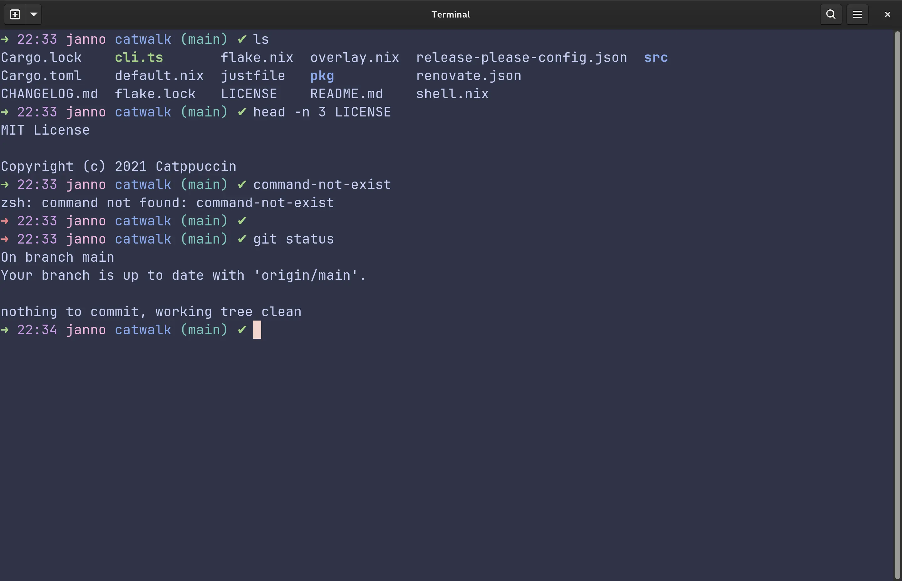
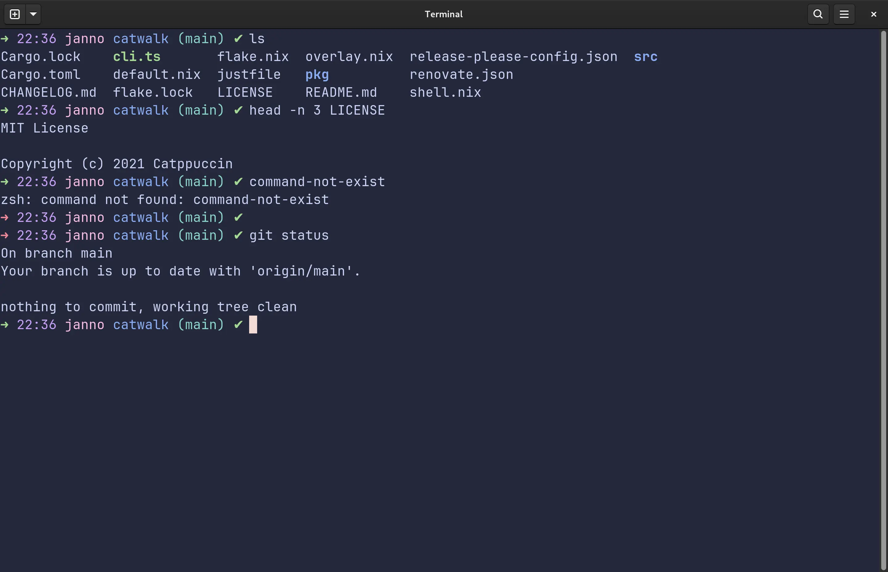
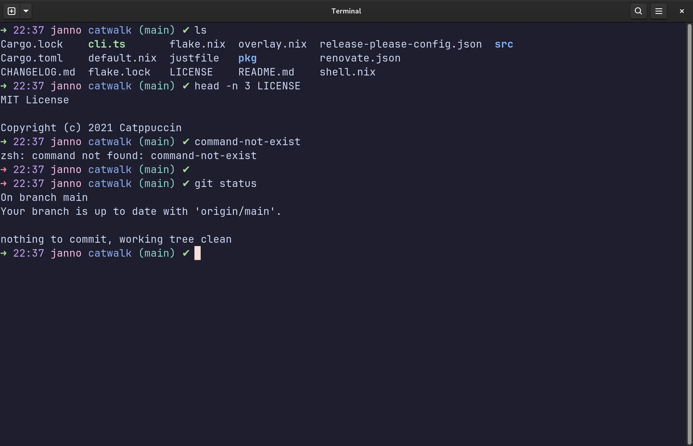

<h3 align="center">
	<br/>
	
	Catppuccin for <a href="https://zsh.sourceforge.io/">Zsh</a>
	
</h3>

<p align="center">
	<a href="https://github.com/JannoTjarks/zsh/stargazers"></a>
	<a href="https://github.com/JannoTjarks/zsh/issues"></a>
	<a href="https://github.com/JannoTjarks/zsh/contributors"></a>
</p>

<p align="center">
	
</p>

## Previews

<details>
<summary>🌻 Latte</summary>

</details>
<details>
<summary>🪴 Frappé</summary>

</details>
<details>
<summary>🌺 Macchiato</summary>

</details>
<details>
<summary>🌿 Mocha</summary>

</details>

## Usage

### [ohmyzsh](https://github.com/ohmyzsh/ohmyzsh)
``` sh
git clone https://github.com/JannoTjarks/catppuccin-zsh.git
mkdir ~/.oh-my-zsh/themes/catppuccin-flavors

ln catppuccin-zsh/catppuccin.zsh-theme ~/.oh-my-zsh/themes/
ln catppuccin-zsh/catppuccin-flavors/* ~/.oh-my-zsh/themes/catppuccin-flavors
```

## 💝 Thanks to

- [JannoTjarks](https://github.com/JannoTjarks)

&nbsp;

<p align="center">
	
</p>

<p align="center">
	Copyright &copy; 2021-present <a href="https://github.com/catppuccin" target="_blank">Catppuccin Org</a>
</p>

<p align="center">
	<a href="https://github.com/catppuccin/catppuccin/blob/main/LICENSE"></a>
</p>
